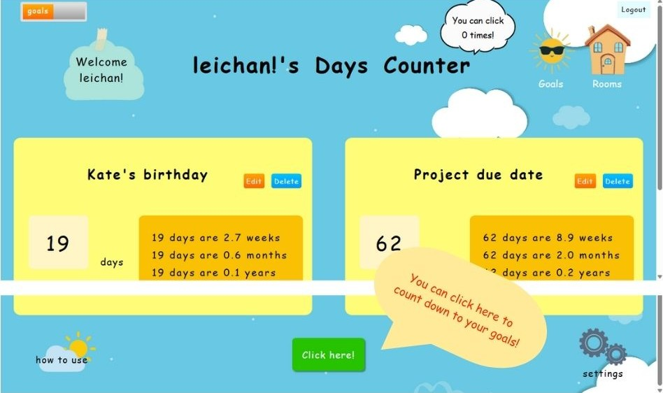
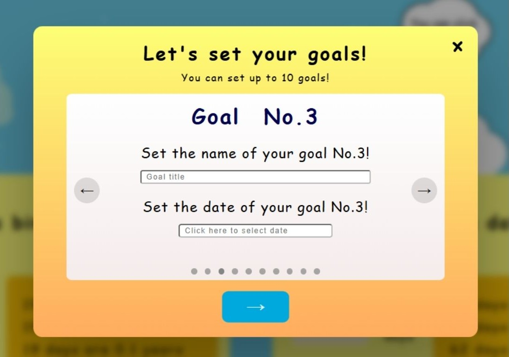
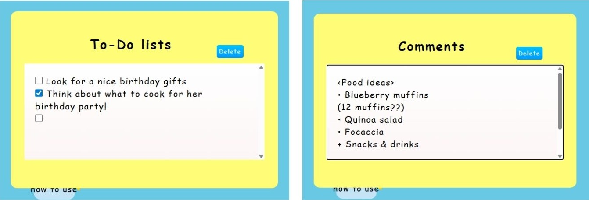
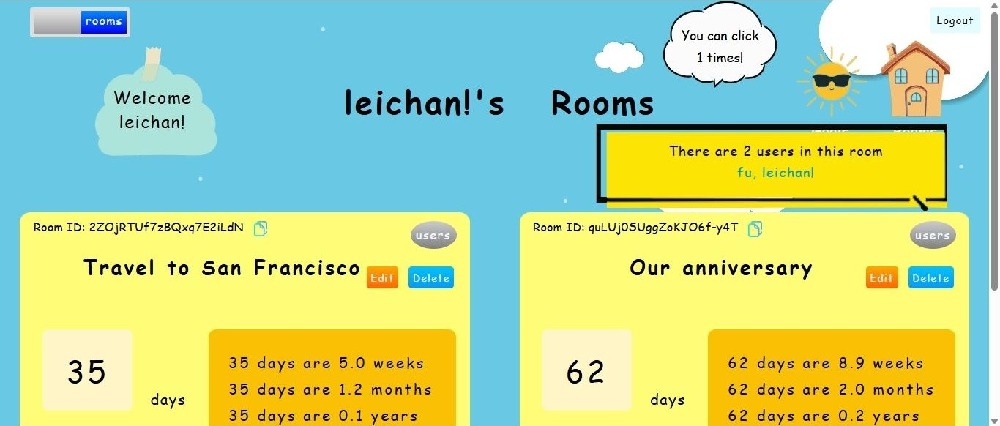
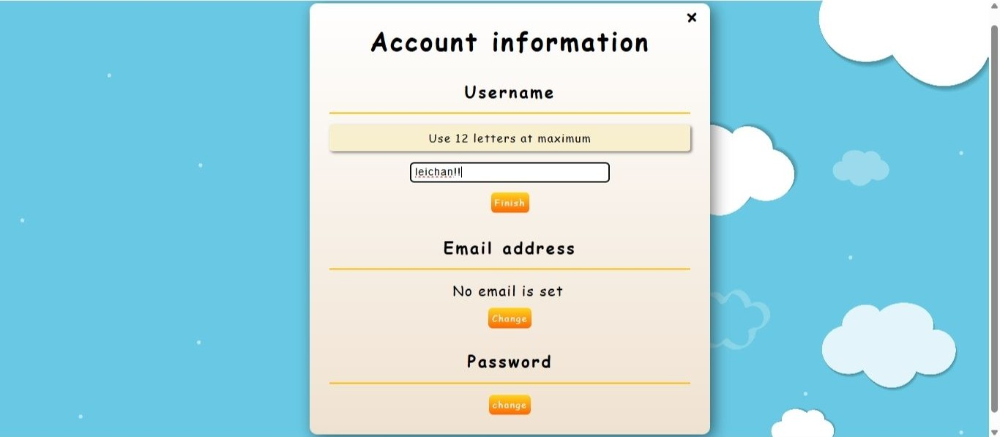

# Days Counter project

Application where users can count down to specific goals (e.g., due dates, travel dates),
either individually or collaboratively, while managing them with To-Do lists and comments.

<h5>link to this application =></h5> https://days-counter-leichan.netlify.app

• Users can set titles and dates for specific goals (e.g., due dates, travel dates) indivisually and count down to the goals every day or when they have time.

• Users can manage the goals with To-Do lists and comments.

• Users can create rooms with other people by sharing the set goals that include the To-Do lists and comments, and count down to them together.

• Users can modify/delete the goals and rooms information.

•Users can modify/delete their account information.

